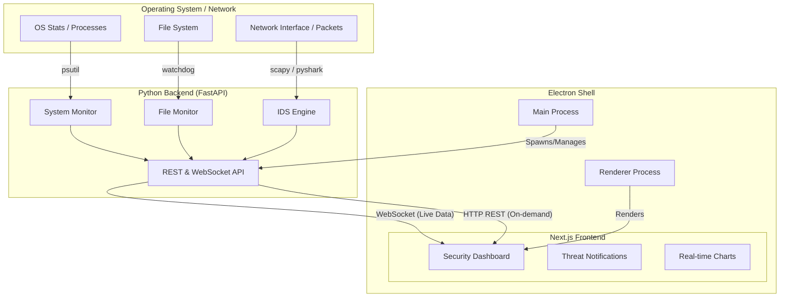

# Stitch SOC: System Architecture & Documentation

Stitch SOC is a comprehensive Security Operations Center (SOC) Desktop Application designed for real-time system monitoring, intrusion detection, and security analysis. It provides a centralized dashboard for security professionals to oversee system health, network traffic, and potential threats.

---

## 🏗️ System Architecture

The application follows a **Decoupled 3-Tier Architecture** wrapped in a desktop shell:

1.  **Backend (The Sensor Layer):** A high-performance Python FastAPI server that interacts directly with the operating system to collect real-time security telemetry.
2.  **Frontend (The Visualization Layer):** A modern Next.js React application that provides a responsive, high-fidelity security dashboard.
3.  **Desktop Shell (The Host Layer):** An Electron wrapper that bundles the web frontend and automates the backend lifecycle, providing a native desktop experience.

### Data Flow Diagram

---

## 🛠️ Tech Stack

### Backend
- **Language**: Python 3.10+
- **Framework**: FastAPI (Asynchronous Web Framework)
- **Server**: Uvicorn (ASGI Server)
- **Real-time**: WebSockets for live telemetry broadcasting.

### Frontend
- **Framework**: Next.js 16+ (React 19)
- **Styling**: Tailwind CSS 4.0 (Modern utility-first CSS)
- **Icons**: Material Symbols Outlined (Google Fonts)
- state Management**: React Hooks (useState, useEffect)
- **Communication**: Native WebSocket API & Fetch API

### Desktop Shell
- **Framework**: Electron (Cross-platform Desktop Apps)
- **Inter-Process**: Node.js `child_process` to manage the Python backend.

---

## 🐍 Python Libraries Used

The backend leverages several low-level libraries for system interaction:

| Library | Purpose |
| :--- | :--- |
| `fastapi` | REST API and WebSocket endpoint management. |
| `psutil` | CPU, RAM, Disk, Process, and Network connection monitoring. |
| `watchdog` | Real-time file system change monitoring (Created/Modified/Deleted). |
| `scapy` / `pyshark` | Network packet capturing and deep packet analysis (DPI). |
| `zxcvbn` | Advanced password strength and entropy analysis. |
| `websockets` | Facilitates real-time data streaming to the frontend. |
| `pydantic` | Data validation and settings management. |

---

## 🚀 Features & Functionalities

### 1. Main Security Dashboard
- **Real-time Telemetry**: Live gauges for CPU, Memory, Disk I/O, and Network throughput.
- **Threat Summary**: High-level overview of the current security posture.
- **Recent Alerts**: A quick-access sidebar for the latest critical notifications.

### 2. Intrusion Detection System (IDS)
- **Signature Analysis**: Detects known sensitive port activity (SSH, RDP, Telnet).
- **Volume Thresholding**: Identifies potential DDoS or scanning attempts based on connection density.
- **Alert Levels**: Categorizes threats as Low, Medium, High, or Critical.

### 3. File System Monitor
- **Integrity Tracking**: Monitors specific directories (e.g., system temp or logs) for unauthorized changes.
- **Action Logs**: Records every file creation, modification, and deletion with user attribution.

### 4. Network Traffic Analysis
- **Connection Mapping**: Lists all active TCP/UDP connections with Remote IP and Local Port details.
- **Bandwidth Monitoring**: Charts upload and download speeds per network interface.

### 5. Password Security Analyzer
- **Entropy Assessment**: Uses the `zxcvbn` algorithm to determine password strength.
- **Feedback Loop**: Provides specific suggestions (e.g., "Add more variety") and crack-time estimates.

### 6. System Performance Monitoring
- **Process Manager**: Lists top resource-consuming processes (PID, Name, CPU%, Memory%).
- **Hardware Health**: Detailed view of disk partitions and filesystem types.

---

## 🎯 What it is & Use Case

**Stitch SOC** is a **Security Information and Event Management (SIEM)** "lite" tool designed for:
- **Individual Security Researchers**: To monitor their own machines for suspicious local activity.
- **Small-Scale Labs**: To provide a visual dashboard for network and file integrity without complex enterprise infra.
- **Educational Environments**: As a platform to learn about OS telemetry, IDS signatures, and modern web application architecture.

It bridges the gap between CLI-based security tools and heavy-duty enterprise SOC platforms by providing a **slick, premium user interface** powered by high-performance asynchronous tracking.
